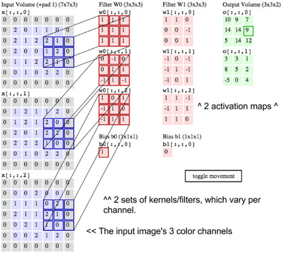
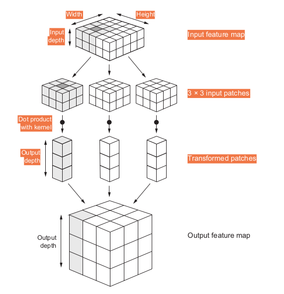

# Somewhat Keras Tutorial - Part 2

## Introduction to Convnets

We’re about to dive into the theory of what convnets are and why they have been so successful at computer vision tasks. But first, let’s take a practical look at a [simple convnet]() example. It uses a convnet to classify MNIST digits, a task we performed in Part 1 using a densely connected network. Even though the convnet will be basic, its accuracy will blow out of the water that of the densely connected model from Part 1.

Whereas the densely connected network from chapter 2 had a test accuracy of 97.8%, the basic convnet has a test accuracy of 99.3%: we decreased the error rate by 68% (relative). Not bad!
But why does this simple convnet work so well, compared to a densely connected model? To answer this, let’s dive into what the `Conv2D` and `MaxPooling2D` layers do.

## The Convolution operation

The fundamental difference between a densely connected layer and a convolution layer is this: Dense layers learn global patterns in their input feature space (for example, for a MNIST digit, patterns involving all pixels), whereas convolution layers learn local patterns: in the case of images, patterns found in small 2D windows of the inputs. In the previous example, these windows were all 3 × 3.

_**Properties of Convnet we might get curious about**_

-  The patterns they learn are **translation invariant**. After learning a certain pattern in the lower-right corner of a picture, a convnet can recognize it anywhere: for example, in the upper-left corner. A densely connected network would have to learn the pattern anew if it appeared at a new location. This makes convnets data efficient when processing images (because the visual world is fundamentally translation invariant): they need fewer training samples to learn representations that have generalization power.

- They can learn **spatial hierarchies** of patterns. A first convolution layer will learn small local patterns such as edges, a second convolution layer will learn larger patterns made of the features of the first layers, and so on. This allows convnets to efficiently learn increasingly complex and abstract visual concepts (because the visual world is fundamentally spatially hierarchical).


## How does a Convnet operate?

Convolutions operate over 3D tensors, called feature maps, with two spatial axes (height and width) as well as a depth axis (also called the channels axis). For an RGB image, the dimension of the depth axis is 3, because the image has three color channels: red, green, and blue. For a black-and-white picture, like the MNIST digits, the depth is 1 (levels of gray)

The convolution operation extracts patches from its input feature map and applies the same transformation to all of these patches, producing an output feature map. This output feature map is still a 3D tensor: it has a width and a height. Its depth can be arbitrary, because the output depth is a hyper-parameter of the layer, and the channels that are selected can be thought of as an abstract _**filter**_ that checks for certain pattern.

*__Filters__* encode specific aspects of the input data: at a high level, a single filter could encode the concept “presence of a face in the input,” for instance.

[Here](http://scs.ryerson.ca/~aharley/vis/conv/)'s a cool visualization to give wings to our imagination.

### Convolutions are defined by two key parameters:

- Size of the patches extracted from the inputs—These are typically 3 × 3 or 5 × 5. In the example, they were 3 × 3, which is a common choice.

- Depth of the output feature map—The number of filters computed by the convolution. The example started with a depth of 32 and ended with a depth of 64.

In Keras `Conv2D` layers, these parameters are the first arguments passed to the layer:
```python
Conv2D(output_depth, (window_height, window_width))
```
A convolution works by sliding these windows of size 3 × 3 or 5 × 5 over the 3D input feature map, stopping at every possible location, and extracting the 3D patch of surrounding features ``(shape (window_height, window_width, input_depth))``.

Each such 3D patch is then transformed (via a tensor product with the same learned weight matrix, called the convolution kernel ) into a 1D vector of shape (output_depth,) . All of these vectors are then spatially reassembled into a 3D output map of shape (height, width, output_depth) . Every spatial location in the output feature map corresponds to the same location in the input feature map (for example, the lower-right corner of the output contains information about the lower-right corner of the input).






Note that the output width and height may differ from the input width and height.
They may differ for two reasons:
1. Border effects, which can be countered by _padding_ the input feature map. Here's Dr. Andrew with an awesome [explanation](https://www.coursera.org/lecture/convolutional-neural-networks/padding-o7CWi)
2. The use of _strides_. Here's Dr Ng again, amazing guy! [video](https://www.coursera.org/lecture/convolutional-neural-networks/strided-convolutions-wfUhx)

## The max-pooling

In the convnet example, we may have noticed that the size of the feature maps is halved after every MaxPooling2D layer. For instance, before the first MaxPooling2D layers, the feature map is 26 × 26, but the max-pooling operation halves it to 13 × 13. That’s the role of max pooling: to aggressively downsample feature maps, much like strided convolutions.

Max pooling consists of extracting windows from the input feature maps and outputting the max value of each channel. It’s conceptually similar to convolution, except that instead of transforming local patches via a learned linear transformation (the convolution kernel), they’re transformed via a hardcoded max tensor operation.

A big difference from convolution is that max pooling is usually done with 2 × 2 windows and stride 2, in order to downsample the feature maps by a factor of 2. On the other hand,
convolution is typically done with 3 × 3 windows and no stride (stride 1).

**Question** Why downsample feature maps this way? Why not remove the max-pooling layers and keep fairly large feature maps all the way up?

Let’s look at this option. The convolutional base of the model would then look like this:

```python
model_no_max_pool = models.Sequential()
model_no_max_pool.add(layers.Conv2D(32, (3, 3), activation='relu',
input_shape=(28, 28, 1)))
model_no_max_pool.add(layers.Conv2D(64, (3, 3), activation='relu'))
model_no_max_pool.add(layers.Conv2D(64, (3, 3), activation='relu'))
```

Here's the generates summary

```python
>>> model_no_max_pool.summary()
```
```
Layer (type)
Output Shape
Param #
================================================================
conv2d_1 (Conv2D)
(None, 26, 26, 32)
320
________________________________________________________________
conv2d_2 (Conv2D)
(None, 24, 24, 64)
18496
________________________________________________________________
conv2d_3 (Conv2D)
(None, 22, 22, 64)
36928
================================================================
Total params: 55,744
Trainable params: 55,744
Non-trainable params: 0
```

**What’s wrong with this setup?**
Two things:
- It isn’t conducive to learning a spatial hierarchy of features. The 3 × 3 windows in the third layer will only contain information coming from 7 × 7 windows in the initial input. The high-level patterns learned by the convnet will still be very small with regard to the initial input, which may not be enough to learn to classify digits (try recognizing a digit by only looking at it through windows that are
7 × 7 pixels!). We need the features from the last convolution layer to contain information about the totality of the input.

- The final feature map has 22 × 22 × 64 = 30,976 total coefficients per sample. This is huge. If we were to flatten it to stick a Dense layer of size 512 on top, that layer would have 15.8 million parameters. This is far too large for such a small model and would result in intense overfitting.


In short, the reason to use downsampling is to reduce the number of feature-map
coefficients to process, as well as to induce spatial-filter hierarchies by making succes-
sive convolution layers look at increasingly large windows

**Max pooling isn’t the only way we can achieve such downsampling. As we already know, we can also use strides in the prior convolution layer. And we can use average pooling instead of max pooling, where each local input patch is transformed by taking the average value of each channel over the patch, rather than the max. But max pooling tends to work better than these alternative solutions. In a nut- shell, the reason is that features tend to encode the spatial presence of some pattern or concept over the different tiles of the feature map (hence, the term feature map),and it’s more informative to look at the maximal presence of different features than at their average presence. So the most reasonable subsampling strategy is to first produce dense maps of features (via unstrided convolutions) and then look at the maximal activation of the features over small patches, rather than looking at sparser windows of the inputs (via strided convolutions) or averaging input patches, which could cause we to miss or dilute feature-presence information**

*__Wait! Striding also downsamples and pooling as downsamples, what should we go for? [here](https://www.reddit.com/r/MachineLearning/comments/5x4jbt/d_strided_convolutions_vs_pooling_layers_pros_and/)'s a reddit thread that'll explain it better__*

# Let's Train a model

Having to train an image-classification model using very little data is a common situation, which we’ll likely encounter in practice if we ever do computer vision in a professional context. A “few” samples can mean anywhere from a few hundred to a few tens of thousands of images. As a practical example, we’ll focus on classifying images as dogs or cats, in a dataset containing 4,000 pictures of cats and dogs (2,000 cats, 2,000 dogs). We’ll use 2,000 pictures for training 1,000 for validation, and 1,000 for testing.

_We'll be using the methods discussed in the Part 1, the universal workflow_

We’ll review two more essential techniques for applying deep learning to small datasets: **_feature extraction with a pretrained network_** and __*fine-tuning a pretrained network*__. Together, these three strategies training a small model from scratch, doing feature extraction using a pretrained model, and fine-tuning a pre-trained model will constitute our future toolbox for tackling the problem of performing image classification with small datasets

## Deep learning only for large datasets, really?

We sometimes hear that deep learning only works when lots of data is available. This is valid in part: one fundamental characteristic of deep learning is that it can find interesting features in the training data on its own, without any need for manual feature engineering, and this can only be achieved when lots of training examples are available. This is especially true for problems where the input samples are very high-dimensional, like images.
But what constitutes lots of samples is relative—relative to the size and depth of the network we’re trying to train, for starters. It isn’t possible to train a convnet to solve a complex problem with just a few tens of samples, but a few hundred can potentially suffice if the model is small and well regularized and the task is simple. Because convnets learn local, translation-invariant features, they’re highly data efficient on perceptual problems. Training a convnet from scratch on a very small image dataset will still yield reasonable results despite a relative lack of data, without the need for any custom feature engineering. We’ll see this in action.

Let's do the classic [Dogs v/s Cats]()

Download the images from [here]()
I used [this]() script to move the data into appropriate directories, just download the data and extract files inside `data` folder (make one if not having already) and run the data shuffle script one level up from data directory.

## Overfit
First we'll create a vanilla convnet in Keras without any fancy data augmentations and regularization just as we mentioned in our _**universal workflow**_.

[Here]() is the script that we can run on our laptop and see our model overfit. The plots generated are no doubt by an overfitted model.

## Regularize
 - Data Augmentations

 Overfitting is caused by having too few samples to learn from, rendering we unable to train a model that can generalize to new data. Given infinite data, our model would be exposed to every possible aspect of the data distribution at hand: we would never overfit. Data augmentation takes the approach of generating more training data from existing training samples, by augmenting the samples via a number of random transformations that yield believable-looking images. The goal is that at training time, our model will never see the exact same picture twice. This helps expose the model to more aspects of the data and generalize better.
 In Keras, this can be done by configuring a number of random transformations to be performed on the images read by the `ImageDataGenerator` instance.

 For example

 ```python
 datagen = ImageDataGenerator(
              rotation_range=40,
              width_shift_range=0.2,
              height_shift_range=0.2,
              shear_range=0.2,
              zoom_range=0.2,
              horizontal_flip=True,
              fill_mode='nearest')
 ```
 Let’s quickly go over this code:
  - `rotation_range` is a value in degrees (0–180), a range within which to randomly rotate pictures.
  - `width_shift` and `height_shift` are ranges (as a fraction of total width or height) within which to randomly translate pictures vertically or horizontally.
  - `shear_range` is for randomly applying shearing transformations.
  - `zoom_range` is for randomly zooming inside pictures.
  - `horizontal_flip` is for randomly flipping half the images horizontally relevant when there are no assumptions of horizontal asymmetry (for example, real-world pictures).
  - `fill_mode` is the strategy used for filling in newly created pixels, which can appear after a rotation or a width/height shift.


Using the new techniques [here](), we were able to overcome the overfitting problem, but don't forget we are having a mere 1000 images as our dataset, well that's great! All we need is a lot of data and we're in business, "NOT SO SOON"! Where would we get the compute power? 60% of we're reading this on phone, don't we :P

## Using a pretrained convnet

A common and highly effective approach to deep learning on small image datasets is to use a pretrained network. A pretrained network is a saved network that was previously trained on a large dataset, typically on a large-scale image-classification task. If this original dataset is large enough and general enough, then the spatial hierarchy of fea- tures learned by the pretrained network can effectively act as a generic model of the visual world, and hence its features can prove useful for many different computer-vision problems, even though these new problems may involve completely different classes than those of the original task.

For instance, we might train a network on ImageNet (where classes are mostly animals and everyday objects) and then repurpose this trained network for something as remote as identifying furniture items in
images. Such portability of learned features across different problems is a key advantage of deep learning compared to many older, shallow-learning approaches, and it makes deep learning very effective for small-data problem

We’ll use the VGG16 architecture, it’s a simple and widely used convnet architecture for ImageNet. Although it’s an older model, far from the current state of the art and somewhat heavier than many other recent models, I chose it because its architecture is similar to what we’re already familiar with and is easy to understand without introducing any new concepts.

**There are two ways to use a pretrained network**:
- feature extraction
- fine-tuning

## Feature Extraction

Feature extraction consists of using the representations learned by a previous network to extract interesting features from new samples. These features are then run through a new classifier, which is trained from scratch.

The regular architecture of convnets start with a series of pooling and convolution layers, and they end with a densely connected classifier. The first part is called the convolutional base of the model. In the case of convnets, feature extraction consists of taking the convolutional base of a previously trained network, running the new data through it, and training a new classifier on top of the output

Why only reuse the convolutional base? Could we reuse the densely connected classifier as well? In general, doing so should be avoided. The reason is that the representations learned by the convolutional base are likely to be more generic and therefore more reusable: the feature maps of a convnet are presence maps of generic concepts over a picture, which is likely to be useful regardless of the computer-vision problem athand. But the representations learned by the classifier will necessarily be specific to the set of classes on which the model was trained they will only contain information about the presence probability of this or that class in the entire picture.

Note that the level of generality (and therefore reusability) of the representations extracted by specific convolution layers depends on the depth of the layer in the model. Layers that come earlier in the model extract local, highly generic feature maps (such as visual edges, colors, and textures), whereas layers that are higher up extract more-abstract concepts (such as “cat ear” or “dog eye”)

In this case, because the `ImageNet` class set contains multiple dog and cat classes, it’s likely to be beneficial to reuse the information contained in the densely connected layers of the original model. But we’ll choose not to, in order to cover the more gen- eral case where the class set of the new problem doesn’t overlap the class set of the original model. Let’s put this in practice by using the convolutional base of the VGG16 network, trained on ImageNet, to extract interesting features from cat and dog images, and then train a dogs-versus-cats classifier on top of these features.

Find the code here. [cats_V_dogs_classifier_VGG16]()

```python
from keras.applications import VGG16

conv_base = VGG16( weights = 'imagenet',
                  include_top = False,
                  input_shape = (150, 150, 3))
```

** we pass three arguments to the constructor:**

- `weights`: specifies the weight checkpoint from which to initialize the model.

- `include_top`: refers to including (or not) the densely connected classifier on top of the network. By default, this densely connected classifier corresponds to the 1,000 classes from ImageNet. Because we intend to use our own densely connected classifier (with only two classes: cat and dog ), we don’t need to include it.

- `input_shape`: is the shape of the image tensors that we’ll feed to the network. This argument is purely optional: if we don’t pass it, the network will be able to process inputs of any size.

Loading `VGG16` model :

```
Layer (type)                 Output Shape              Param #   
=================================================================
input_1 (InputLayer)         (None, 150, 150, 3)       0         
_________________________________________________________________
block1_conv1 (Conv2D)        (None, 150, 150, 64)      1792      
_________________________________________________________________
block1_conv2 (Conv2D)        (None, 150, 150, 64)      36928     
_________________________________________________________________
block1_pool (MaxPooling2D)   (None, 75, 75, 64)        0         
_________________________________________________________________
block2_conv1 (Conv2D)        (None, 75, 75, 128)       73856     
_________________________________________________________________
block2_conv2 (Conv2D)        (None, 75, 75, 128)       147584    
_________________________________________________________________
block2_pool (MaxPooling2D)   (None, 37, 37, 128)       0         
_________________________________________________________________
block3_conv1 (Conv2D)        (None, 37, 37, 256)       295168    
_________________________________________________________________
block3_conv2 (Conv2D)        (None, 37, 37, 256)       590080    
_________________________________________________________________
block3_conv3 (Conv2D)        (None, 37, 37, 256)       590080    
_________________________________________________________________
block3_pool (MaxPooling2D)   (None, 18, 18, 256)       0         
_________________________________________________________________
block4_conv1 (Conv2D)        (None, 18, 18, 512)       1180160   
_________________________________________________________________
block4_conv2 (Conv2D)        (None, 18, 18, 512)       2359808   
_________________________________________________________________
block4_conv3 (Conv2D)        (None, 18, 18, 512)       2359808   
_________________________________________________________________
block4_pool (MaxPooling2D)   (None, 9, 9, 512)         0         
_________________________________________________________________
block5_conv1 (Conv2D)        (None, 9, 9, 512)         2359808   
_________________________________________________________________
block5_conv2 (Conv2D)        (None, 9, 9, 512)         2359808   
_________________________________________________________________
block5_conv3 (Conv2D)        (None, 9, 9, 512)         2359808   
_________________________________________________________________
block5_pool (MaxPooling2D)   (None, 4, 4, 512)         0         
=================================================================
Total params: 14,714,688
Trainable params: 14,714,688
Non-trainable params: 0
```
At this point, there are **two** ways we could proceed:

- Running the convolutional base over our dataset, recording its output to a `Numpy` array on disk, and then using this data as input to a standalone, densely connected classifier similar to those we saw in part 1. This solution is fast and cheap to run, because it only requires running the convolutional base once for every input image, and the convolutional base is by far the most expensive part of the pipeline. But for the same reason, this technique won’t allow we to use data augmentation.

- Extending the model we have `conv_base` by adding Dense layers on top, and running the whole thing end to end on the input data. This will allow we to use data augmentation, because every input image goes through the convolutional base every time it’s seen by the model. But for the same reason, this technique is far more expensive than the first.

Let's do them both:

_**Fast feature extraction and without data augmentation [code-link]()**_

We’ll start by running instances of the previously introduced ImageDataGenerator to extract images as Numpy arrays as well as their labels. We’ll extract features from these images by calling the predict method of the conv_base model.

The extracted features are currently of shape (samples, 4, 4, 512) . We’ll feed them to a densely connected classifier, so first we must flatten them to (samples, 8192).

Now we can train our densely connected classifier with the help of our base convolution model.

Try running the code.

_**Feature extraction with data augmentation**_

Let's focus on the second technique where we use the base model inside a larger model which has the last few layers as randomly instantiated. This effectively creates a larger model with last few layers untrained and previous layer **FROZEN**.

**Note**: *_Freezing a layer or set of layers means preventing their weights from being updated during training. If we don’t do this, then the representations that were previously learned by the convolutional base will be modified during training. Because the Dense layers on top are randomly initialized, very large weight updates would be propagated through the network, effectively destroying the representations previously learned._*

Try running the code.


## Fine-Tuning [code]()

Another widely used technique for model reuse, complementary to feature extraction, is fine-tuning. Fine-tuning consists of unfreezing a few of the top layers of a frozen model base used for feature extraction, and jointly training both the newly added part of the model (in this case, the fully connected classifier) and these top layers. This is called fine-tuning because it slightly adjusts the more abstract representations of the model being reused, in order to make them more relevant for the problem at hand.

**Note**

It’s necessary to freeze the convolution base of VGG16 in order to be able to train a randomly initialized classifier on top. For the same reason, it’s only possible to fine-tune the top layers of the convolutional base once the classifier on top has already been trained. If the classifier isn’t already trained, then the error signal propagating through the network during training will be too large, and the representations previously learned by the layers being fine-tuned will be destroyed. Thus the steps for fine-tuning a network are as follow:

- Add custom network on top of an already-trained base network.
- Freeze the base network.
- Train the part we added.
- Unfreeze some layers in the base network.
- Jointly train both these layers and the part we added.


Try to run the code.


## Visualizing ConvNets

It’s often said that deep-learning models are “black boxes”: learning representations that are difficult to extract and present in a human-readable form. Although this is partially true for certain types of deep-learning models, it’s definitely not true for convnets.

The representations learned by convnets are highly amenable to visualization, in large part because they’re representations of visual concepts. Since 2013, a wide array of techniques have been developed for visualizing and interpreting these representations.

Let's try visualizing:

- Visualizing intermediate convnet outputs (intermediate activations): Useful for
understanding how successive convnet layers transform their input, and for getting a first idea of the meaning of individual convnet filters.

- Visualizing convnets filters: Useful for understanding precisely what visual pattern or concept each filter in a convnet is receptive to.

- Visualizing heatmaps of class activation in an image—Useful for understanding which parts of an image were identified as belonging to a given class, thus allowing you to localize objects in images.


**Visualizing intermediate activations**

Visualizing intermediate activations consists of displaying the feature maps that are output by various convolution and pooling layers in a network, given a certain input (the output of a layer is often called its activation, the output of the activation function). This gives a view into how an input is decomposed into the different filters learned by the network

We want to visualize feature maps with three dimensions: width, height, and depth (channels). Each channel encodes relatively independent features, so the proper way to visualize these feature maps is by independently plotting the contents of every channel as a 2D image.

_[Code-link]()_

We would load the same VGG16 model and visualize our cats v/s dog data on it.

There are a few things to note here:

- The first layer acts as a collection of various edge detectors. At that stage, the activations retain almost all of the information present in the initial picture.
- As you go higher, the activations become increasingly abstract and less visually interpretable. They begin to encode higher-level concepts such as “cat ear” and “cat eye.” Higher presentations carry increasingly less information about the visual contents of the image, and increasingly more information related to the class of the image.
- The sparsity of the activations increases with the depth of the layer: in the first layer, all filters are activated by the input image; but in the following layers, more and more filters are blank. This means the pattern encoded by the filter isn’t found in the input image.

We have just evidenced an important universal characteristic of the representations learned by deep neural networks: the features extracted by a layer become increasingly abstract with the depth of the layer. The activations of higher layers carry less and less information about the specific input being seen, and more and more information about the target (in this case, the class of the image: cat or dog). A deep neural network effectively acts as an information distillation pipeline, with raw data going in (in this case, RGB pictures) and being repeatedly transformed so that irrelevant information is filtered out (for example, the specific visual appearance of the image), and useful information is magnified and refined (for example, the class of the image).

## Visualizing convnet filters

Another easy way to inspect the filter learned convnet is to display the visual pattern that each filter is meant to respond to. This can be done with gradient ascent in input space: applying gradient descent to the value of the input image of a convnet so as to maximize the response of a specific filter, starting from a blank input image. The resulting input image will be one that chosen filter is maximally responsive to.

The process is simple: we'll build a loss function that maximizes the value of a given filter in a given convolution layer, and then we'll use stochastic gradient descent to adjust the value of the input image so as to maximize the activation value.

Try the [code]().

These filter visualizations tell you a lot about how convnet layers see the world: each layer in a convnet learns a collection of filters such that their inputs can be expressed as a combination of the filters. This is similar to how the Fourier transform decomposes signals onto a bank of cosine functions. The filters in these convnet filter banks get increasingly complex and refined as you go higher in the model:

- The filters from the first layer in the model ( block1_conv1 ) encode simple directional edges and colors (or colored edges, in some cases).

- The filters from block2_conv1 encode simple textures made from combinations of edges and colors.

- The filters in higher layers begin to resemble textures found in natural images: feathers, eyes, leaves, and so on.

## Visualizing heatmaps of the class activation

Another visualization technique, one that is useful for understanding which part of a given image led a convnet to predict a particular class. This is helpful for debugging the decision process of a convnet, particularly in the case of a classification mistake.

This technique is called class activation map (CAM) visualization, and it consists of producing heatmaps of class activation over input images.
A class activation heatmap is a 2D grid of scores associated with a specific output of class, computed for every location in any input image, indicating the importance of each location.

The specific implementation we'll use is the one described in "Grad-CAM: Visual Explanation from Deep Networks via Gradient-based Localization". It's very simple: it consists of taking the output feature map of a convolution layer, given an input image, and weighing every channel in that feature map by the gradient of the class with respect to the channel. Intuitively, one way to understand this trick is that we’re weighting a spatial map of “how intensely the input image activates different channels” by “how important each channel is with regard to the class,” resulting in a spatial map of “how intensely the input image activates the class.”

Try running the [code]().


This visualization technique answers two important questions:

- Why did the network think this image contained an African elephant?
- Where is the African elephant located in the picture?

In particular, it’s interesting to note that the ears of the elephant calf are strongly activated: this is probably how the network can tell the difference between African and Indian elephants
